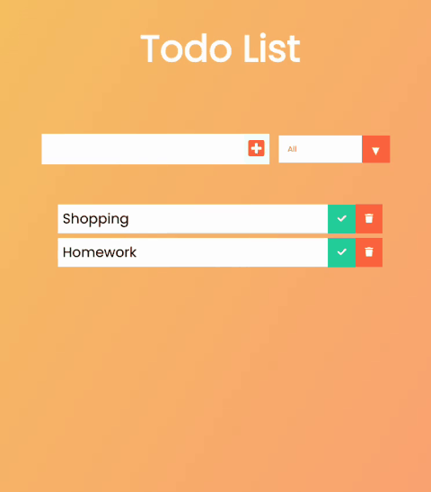

# 📝 To-Do App com React

Este é um projeto simples de lista de tarefas (To-Do) desenvolvido com **React.js**. Ele permite que o usuário adicione, visualize e remova tarefas de maneira prática e rápida. É um excelente exemplo de como trabalhar com componentes, `useState`, eventos e listas em React.

## 🚀 Funcionalidades

- ✅ Adicionar novas tarefas
- ❌ Remover tarefas da lista
- 📄 Listagem das tarefas adicionadas
- 💾 Armazenamento temporário na memória (sem backend)

## 🧪 Tecnologias Utilizadas

- [React.js](https://reactjs.org/)
- HTML5
- CSS3
- JavaScript (ES6+)
- [Vite](https://vitejs.dev/) ou [Create React App](https://create-react-app.dev/) (dependendo da base que você usou)

## 📸 Demonstração

 <!-- Substitua por uma imagem ou GIF do seu app em funcionamento -->

## 🛠️ Como executar localmente

```bash
# Clone este repositório
git clone https://github.com/seu-usuario/todo-app-react.git

# Acesse a pasta do projeto
cd todo-app-react

# Instale as dependências
npm install

# Execute a aplicação
npm start
```

Acesse http://localhost:3000 no navegador para ver o app rodando.

## 📁 Estrutura do Projeto
```bash
src/
├── components/
│   └── TodoItem.jsx
├── App.jsx
├── index.js
└── styles.css
```

## 📌 Aprendizados

Durante o desenvolvimento deste projeto, aprofundei meus conhecimentos em:
- Gerenciamento de estado com useState
- Manipulação de eventos em formulários
- Renderização condicional e de listas
- Separação de componentes

## 📄 Licença

Este projeto está sob a licença MIT. Veja o arquivo LICENSE para mais detalhes.
